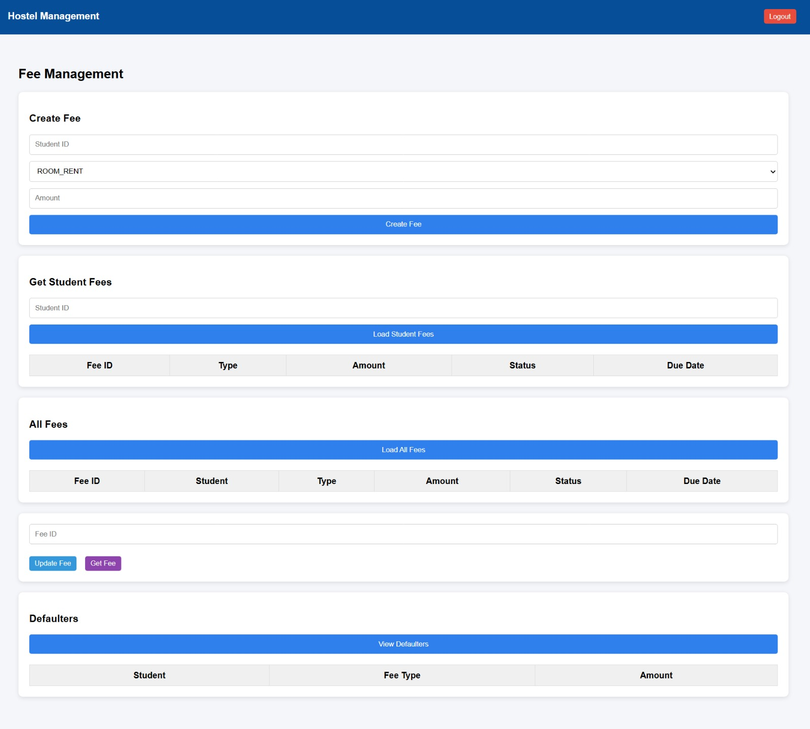

# User Manual
Hostel Management System

---

# 1. Introduction

The Hostel Management System is a web-based application designed to manage hostel operations efficiently.

It provides functionality for administrators, wardens, mess managers, and students to manage hostel activities such as:

- Student management
- Room allocation
- Fee management
- Payment tracking
- Complaint handling
- Mess services

The system is accessible through a web interface built using **ReactJS**, while the backend is powered by **Spring Boot** and **MySQL database**.

The system implements **Role-Based Access Control (RBAC)**, ensuring that each user can only access the features permitted for their role.

---

# 2. System Roles

The Hostel Management System supports the following roles:

| Role | Description |
|-----|-------------|
| Admin | Has full system access and manages hostel operations |
| Warden | Manages student records and room allocations |
| Student | Accesses personal hostel information and services |
| Mess Manager | Manages mess menu and student mess attendance |

Each role is redirected to a **role-specific dashboard** after login.

---

# 3. Login

Users must log in using their registered credentials.

### Steps

1. Open the application in a web browser.
2. Navigate to the login page.
3. Enter **username** and **password**.
4. Click **Login**.

If the credentials are valid, the system authenticates the user and redirects them to the **dashboard corresponding to their role**.

Example screen:

---

# 4. Dashboard

After successful login, users are redirected to their dashboard.

The dashboard displays the modules that the user is allowed to access based on their role.

### Dashboard Access by Role

| Role | Accessible Modules |
|-----|--------------------|
| Admin | Students, Rooms, Fees, Complaints, Mess |
| Warden | Students, Rooms, Complaints |
| Student | Profile, My Room, My Fees, Complaints, Mess |
| Mess Manager | Mess Menu, Mess Attendance |

Example screen:

---

# 5. Student Management

This module allows **Admin and Warden** to manage student records.

### Features

- Add new student
- Update student details
- Delete student
- View student list
- Checkout student

This module helps maintain accurate student records and hostel occupancy information.

Example screen:

---

# 6. Room Management

This module manages hostel rooms and room allocations.

### Access Roles

- Admin
- Warden

### Features

- Create room
- Update room details
- Delete room
- View available rooms
- Allocate room to students
- Deallocate rooms

The system automatically updates room occupancy and status based on allocations.

Example screen:

---

# 7. Fee Management

This module manages hostel fees and payment tracking.

### Admin / Warden Capabilities

- Create student fees
- Update fee records
- View all fees
- Identify fee defaulters

### Student Capabilities

- View assigned fees
- Make payments
- View payment history
- Access payment receipts

Example screen:

---

# 8. Payment System

Students can pay hostel fees directly through the system.

### Features

- Make fee payment
- View payment history
- Generate payment receipt

This ensures transparent financial tracking within the hostel system.

Example screen:

---

# 9. Complaint Management

Students can submit complaints related to hostel facilities.

### Student Features

- Submit complaint
- Track complaint status
- View complaint history

### Admin / Warden Features

- View all complaints
- Update complaint status
- Mark complaints as resolved

Complaint status may change through the following stages:

- OPEN
- IN_PROGRESS
- RESOLVED

Example screen:

---

# 10. Mess Management

The mess management module handles food services in the hostel.

### Mess Manager Capabilities

- Create mess menu
- Update mess menu
- Mark student mess attendance
- View attendance records

### Student Capabilities

- View daily mess menu
- Mark mess attendance

Example screen:

---

# 11. Logout

Users can securely log out of the system by clicking the **Logout** option in the navigation menu.

Logging out terminates the current session and redirects the user back to the login page.

---

# 12. Conclusion

The Hostel Management System provides an integrated platform for managing hostel operations.

By implementing **role-based access control**, the system ensures that users can only access features relevant to their responsibilities.

This improves system security, operational efficiency, and transparency for both administrators and students.